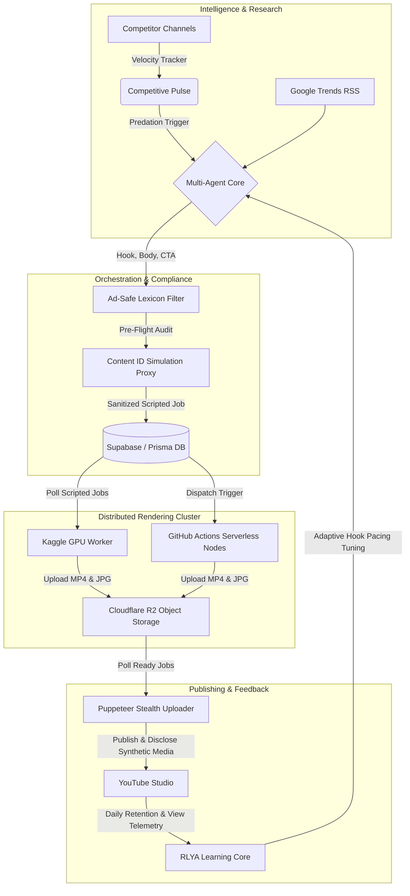

# SIMPLYYTR — State-of-the-Art Autonomous YouTube Revenue Engine (2026)

**SIMPLYYTR** is an end-to-end, multi-agent autonomous operations platform engineered for real-time video intelligence, recursive learning from viewer retention, pre-flight monetization compliance, and zero-marginal-cost distributed rendering.

---

## 🏗️ Architectural Overview

The platform operates across five interconnected operational layers:



---

## 🚀 Key SOTA Capabilities

### 1. 🕹️ Cyber-Noir Command Center (`apps/web`)
- **Design System:** Obsidian Black (`#0e0e0f`), Electric Glow-Cyan (`#00f0ff`), Terminal Green (`#00fb40`), Alert Orange (`#ff8c00`) with Sora & JetBrains Mono typography.
- **7 Mission Control Tabs:** Command Center, Competitive Pulse, Compliance Proxy, RLYA Learning Core, Compute Nodes, Revenue Center, and System Configuration Bay.

### 2. ⚡ Competitive Pulse & Trend-Jacking
- **Velocity Tracker:** Scans rival channels and calculates real-time velocity (views/hour).
- **Rapid-Response Generation:** Triggers counter-narrative and high-energy shorts in `<4 hours` to ride viral waves before saturation.

### 3. 🛡️ Compliance & Content ID Simulation Proxy
- **Ad-Safe Lexicon Scanner:** Automatically replaces demonetization triggers (e.g., *"killed it"* $\rightarrow$ *"crushed it"*, *"insane"* $\rightarrow$ *"wild"*, *"destroy"* $\rightarrow$ *"transform"*).
- **Pre-Flight Risk Score:** Computes real-time copyright and demonetization risk percentages.
- **Synthetic Media Disclosure:** Automatically tags YouTube's altered/synthetic media disclosure requirements.

### 4. 🧠 Recursive Learning Core (RLYA)
- **Second-by-Second Telemetry:** Analyzes audience retention drop-offs and adjusts prompt hook density (e.g. 2s vs 3s hook duration, rapid scene cuts).
- **Autonomous Niche Pivot:** Automatically suggests and pivots channel niches when view metrics fall below engagement thresholds.

### 5. 🖥️ Zero-Marginal-Cost Distributed Rendering
- **Hybrid Compute Map:** Leverages **Kaggle GPU workers** (SadTalker lip-sync & Faster-Whisper) alongside parallel **GitHub Actions headless matrix runners** for near-$0 marginal cost FFmpeg rendering.

---

## 🛠️ Tech Stack & Prerequisites

- **Frontend / HUD:** Next.js 16 + React 19 + Tailwind CSS + Material Symbols
- **Backend Service:** Node.js + Express + TypeScript + node-cron
- **Database:** Supabase PostgreSQL + Prisma ORM
- **Object Storage:** Cloudflare R2
- **Video Workers:** Python 3.11 + FFmpeg + Edge-TTS + yt-dlp + Faster-Whisper + SadTalker
- **Uploader Agent:** Node.js + Puppeteer Extra (Stealth Plugin)

---

## ⚙️ Running Locally

1. **Install Dependencies:**
   ```bash
   npm install
   npm run postinstall --workspace=web
   ```

2. **Generate Database Client:**
   ```bash
   npx prisma generate --schema=packages/database/prisma/schema.prisma
   ```

3. **Start the Master Command Center:**
   ```bash
   cd apps/web
   npm run dev
   ```
   *Access the HUD at `http://localhost:3000`.*

4. **Start the Backend Engine & Cron Clock:**
   ```bash
   cd apps/backend
   npm run dev
   ```
