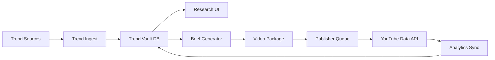

# YouTube Automation Platform Roadmap

## Goal
Build a compliant, state-of-the-art YouTube operations platform with two products:

1. Trend Intelligence Vault
- Ingest trending topics, short-form video metadata, transcripts, tags, thumbnails, captions, and performance signals.
- Let you study what is working and turn it into original content ideas.
- Only download full media for content you own, are licensed to use, or have explicit permission to reuse.

2. YouTube Publisher
- Accept finished video packages.
- Upload, schedule, retry, and track YouTube publishing.
- Sync analytics back into the system for feedback and improvement.

## Important Boundary
Do not build this as a channel-cloning or unauthorized reposting tool.
Use trends for inspiration, analysis, and original content generation.

## Recommended Stack
- Backend: Node.js + TypeScript
- Web app: Next.js or React dashboard
- Worker system: queue-based jobs for ingest, render, upload, analytics
- Database: PostgreSQL
- Object storage: S3-compatible storage
- Video processing: FFmpeg
- Auth: OAuth for YouTube, session auth for dashboard users

## High-Level Architecture

## Core Modules
- Trend ingestion: search feeds, niche watchlists, manual URL import, transcript capture, metadata extraction.
- Content research: scoring, clustering, notes, competitor comparison, and topic brief generation.
- Asset management: thumbnails, scripts, captions, audio, rendered video, publish history.
- Publishing: upload, title/description/tag validation, scheduling, retries, audit logs.
- Analytics: views, CTR, retention, engagement, growth tracking.
- Human review: approval step before any publish or external-content-derived workflow.

## Shared Data Model
- Channel
- TrendSignal
- VideoCandidate
- ContentBrief
- Asset
- RenderJob
- PublishJob
- AnalyticsSnapshot
- AuditEvent

## Phase 1: Foundation
Deliverables:
- Repo scaffolding
- Authentication
- PostgreSQL schema
- Storage integration
- Job queue
- Audit logging
- Dashboard shell

Exit criteria:
- User can sign in
- System can store projects, channels, and jobs
- Dashboard shows job status and audit trail

## Phase 2: Trend Intelligence Vault
Deliverables:
- Import trending topics and video metadata
- Save transcripts/captions/notes
- Search and filter by niche, score, source, and date
- Generate original content briefs
- Optional download only for rights-cleared content

Exit criteria:
- User can research trends in one place
- User can convert a trend into a content brief

## Phase 3: YouTube Publisher
Deliverables:
- OAuth connection to YouTube
- Upload and schedule videos
- Validate title, description, tags, thumbnail, and privacy settings
- Retry failed uploads
- Save publish logs and analytics snapshots

Exit criteria:
- User can publish a packaged video to YouTube
- Analytics sync back into the system automatically

## Phase 4: Intelligence Layer
Deliverables:
- Trend clustering
- Topic scoring
- Title and thumbnail suggestions
- Best-time scheduling
- Performance feedback loop
- Channel-specific learning over time

Exit criteria:
- System improves recommendations from real publishing data

## Phase 5: Hardening
Deliverables:
- Rate limiting
- Secret management
- Permission scoping
- Error handling and retries
- Data retention rules
- Legal/compliance review

Exit criteria:
- Safe enough for real channel operations
- Clear separation between owned content, licensed content, and analysis-only content

## Suggested MVP Cut
If you want the fastest useful version, build this first:
1. Trend ingestion from a small source list
2. Research dashboard with search and notes
3. Original brief generator
4. YouTube upload and scheduling
5. Analytics sync

## What to Avoid
- Auto-reposting videos you do not own or have rights to use
- Channel cloning that copies thumbnails, titles, structure, or branding too closely
- Scraping or downloading content in ways that violate platform rules

## Next Step
If you want, the next artifact should be a full PRD with:
- user stories
- feature priority
- schema draft
- API endpoints
- folder structure
- milestone timeline
